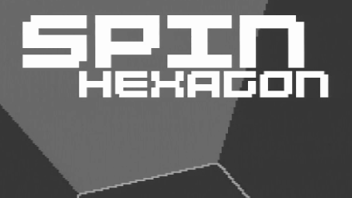
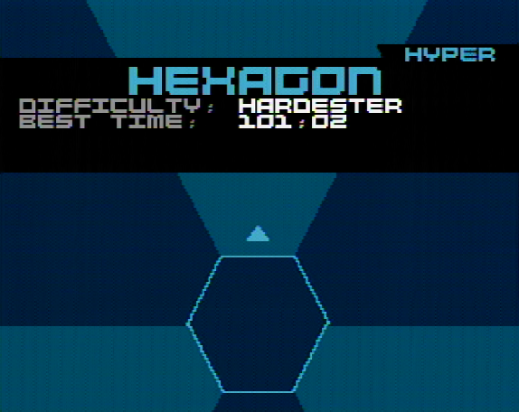

Spin Hexagon
============

_Spin Hexagon_ is a port of _Super Hexagon_ to the Propeller 1. It implements most features from the original game.
(Most notably absent are the pentagon/square modes and the ending sequence.)

## How to play
You control the little triangle orbiting the central Hexagon.
The object of the game is to avoid getting hit by the incoming walls for as long as possible. Simple, isn't it?


### Controls

|  Keyboard  |    SNES    |   What it does   |
|------------|------------|------------------|
| Arrow Keys |D-Pad or L/R|Rotate triangle   |
| Space Bar  |     A      |Confirm / Restart |
|    Esc     |   Start    |Give up / Back    |
|  PrintScr  |   Select   |Switch NTSC/PAL60 |
|Ctrl+Alt+Del|    ---     |Quit game (REBOOT)|

## Hardware Requirements
 - 80 MHz CLKFREQ or more
 - Standard TV output circuit (CRT-based TV/monitor recommended)
 - Standard audio output circuit (stereo recommended)
 - PS/2 keyboard or SNES controller (you can of course modify the code to support whatever you need)
 - SD card (you can play without, but you won't get any sound and won't be able to save your best times and unlocked levels.)

See the [relevant FAQ section](#how-do-i-adapt-it-to-my-board) for porting instructions.

## Screenshots




## FAQ
### How do I compile it?
I like to use the rake build system, but if you don't want to install that, I've provided instructions for building manually.
#### Using the Rakefile
You will need:
 - fastspin 4.3.0 (higher should work). At the time of writing, this version has not been released, use a git build.
 - ruby 2.6 (lower/higher should work)
 - rake (usually bundled with ruby)

Simply type `rake` and it will compile everything you need. Head on to the installation question. 

If you have modified any file and want to re-build, you might have to run `rake clean` first (this wouldn't be necessary if fastspin could emit dependency info - get on it, Eric :) )
#### Manually
You will need:
 - fastspin 4.3.0 (higher should work). At the time of writing, this version has not been released, use a git build.

Run the following commands:
```batch
    fastspin -O1,inline-single,loop-reduce --fcache=#86 -Werror -c Keyboard.spin
    fastspin -O1,inline-single,loop-reduce --fcache=#86 -Werror -c tinySDDA.spin
    fastspin -O1,inline-single,loop-reduce --fcache=#86 -Werror -c VJET_v00_composite.spin
    fastspin -O1,inline-single,loop-reduce --fcache=#86 -Werror -c VJET_v00_rendering.spin
    fastspin -O1,inline-single,loop-reduce --fcache=#86 -Werror -l hexagon.spin
    fastspin -O1,inline-single,loop-reduce --fcache=#86 -Werror -l hexagon_boot.spin
    copy hexagon.binary HEXAGON.BI2
    copy hexagon_boot.binary HEXAGON.BIN
```
(use `cp` instead of `copy` on Linux/BSD/MacOS)

### How do I install it?

#### With SD card
Copy `HEXAGON.BI2` and all .RAW and .VU files (don't worry, it will yell at you if you miss one) into the root directorsy of your SD card.

Then, if you are using an Operating system that can boot .BIN files, also copy `HEXAGON.BIN`. Else, load `hexagon_boot.binary` into EEPROM or RAM the usual way.

#### Without SD card
Load `hexagon.binary` into EEPROM or RAM the usual way. You will not get any sound and won't be able to save your best times and unlocked levels.

### How do I adapt it to my board?
Simply open up `platform.spin` and adapt it to your needs.

Note that if you want an input method that is neither a SNES controller nor a PS/2 Keyboard, you will have to modify the code - look into `PUB update` in `hexagon.spin`

Also note that C3-style SPI busses are not supported at the moment, but modifying the code for that shouldn't be too difficult - tinySDDA in particular just selects the card once and never deselects it, so you'd only need to tweak the init code. Relatedly, not that the version of `SD-MMC_FATEngine.spin` used by the booter is slightly customized - it has some slight Spin modifications to allow finding the sector adresses of files and a small ASM modification to leave the last 512 bytes of RAM alone when booting.

Also note that there is currently no VGA support whatsoever.
If you want to port to VGA (or P2!) please contact me, I can give you some materials and advice.

### What's the situation with trademarks/copyrights?
I've got permission from the creator of _Super Hexagon_ to distribute _Spin Hexagon_.
> Hey!
> 
> Yes, you have my permission to distribute this however you like! This looks fantastic, by the way - I can really see an attention to detail in recreating the wave design and timing from Super Hexagon. Nice work!
> 
> -Terry Cavanagh, in an E-Mail to me 

### I can't get it to work or have further questions!
Just ask! Ideally in the SpinHexagon thread on the Parallax Forum.
